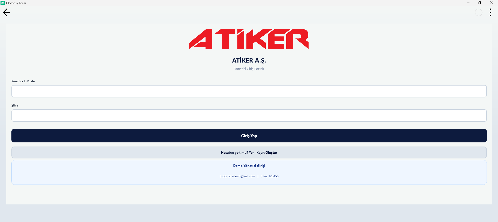
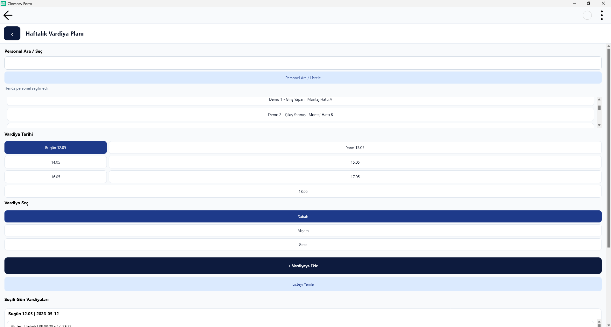

# VardiyaApp

VardiyaApp, Atiker için geliştirilen bir vardiya ve personel takip uygulamasıdır. Personel kullanıcıları günlük görevlerini, izin taleplerini ve mola durumlarını takip ederken; yöneticiler personel yönetimi, vardiya planlama ve raporlama ekranlarını kullanabilir.

## Özellikler

- Personel ve yönetici tarafı için ayrı giriş ekranları.
- Personelin günlük vardiya, izin ve mola durumunu görüntüleme.
- Personelin izin talebi oluşturma ve yöneticinin bu talepleri onaylama / reddetme.
- Yönetici tarafında vardiya atama, düzenleme ve haftalık plan görüntüleme.
- Personel için PIN tabanlı giriş / çıkış takibi ve PIN geçmişi kaydı.
- Supabase REST API + özel PostgreSQL RPC fonksiyonları ile backend entegrasyonu.

## Ekran Görüntüleri

Aşağıdaki ekran görüntüleri `ScreenShots/` klasöründe saklanıyor. Repo ziyaretçileri bu klasörü görüntüleyerek uygulamanın ana sayfalarını inceleyebilir.

- `ScreenShots/Giris.png`
- `ScreenShots/personelgiris.png`
- `ScreenShots/yönetisigiris.png`
- `ScreenShots/yöneticianasayfa.png`
- `ScreenShots/yöneticivardiyatama.png`
- `ScreenShots/yöneticivardiyatama2.png`
- `ScreenShots/yöneticiizintalebi.png`
- `ScreenShots/yöneticiverilenpingecmisi.png`
- `ScreenShots/yöneticigiriscikistakibi.png`
- `ScreenShots/calisananasayfa.png`
- `ScreenShots/calisanizintalebi.png`
- `ScreenShots/calisanmolatalebi.png`
- `ScreenShots/calisanprofil.png`

### Öne Çıkan Sayfalar

#### Giriş Ekranı


#### Personel Giriş


#### Yönetici Giriş



#### Yönetici Paneli


#### Vardiya Atama



#### Personel Ana Sayfa


## Veritabanı ve Backend Mimarisi

Bu uygulama, Supabase REST API üzerinden PostgreSQL ile iletişim kurar. Uygulama içinde kullanılan ana veri akışı şöyle çalışır:

- Kullanıcılar `users` tablosu üzerinden doğrulanır.
- Personel ve yönetici rollerine göre ayrı sorgular çalışır: `role=eq.user` veya `role=eq.admin`.
- Çoğu karmaşık iş mantığı, Supabase üzerinde tanımlı PostgreSQL `RPC` fonksiyonları ile sağlanır.
- Uygulamadaki tüm API çağrıları `apikey` ve `Authorization: Bearer <key>` başlıkları ile gönderilir.

### Kullanılan ana RPC fonksiyonları

- `set_current_user`
- `get_profile_field`
- `submit_leave_request`
- `update_leave_request_status`
- `list_pending_leave_requests`
- `assign_shift_by_email`
- `update_shift_by_id`
- `delete_shift_by_id`
- `list_shifts_manage_by_date`
- `list_personel_picker`
- `get_employee_today_shift_by_user`
- `get_employee_attendance_status_by_user`
- `get_employee_leave_status_by_user`
- `get_employee_break_status_by_user`
- `generate_employee_pin`
- `handle_pin_attendance`
- `list_today_attendance_report`
- `list_missing_users_today`
- `list_pin_action_logs_simple`
- `list_personel_manage`
- `create_personel_manage`
- `update_personel_manage`
- `delete_personel_manage`

### Örnek veritabanı şeması

Aşağıdaki tablo yapıları, uygulamanın kullandığı temel veri modellerini yansıtır.

#### `users`

```sql
CREATE TABLE users (
  id uuid PRIMARY KEY,
  full_name text NOT NULL,
  email text UNIQUE NOT NULL,
  password text NOT NULL,
  role text NOT NULL, -- user veya admin
  department text,
  position text,
  created_at timestamptz DEFAULT now()
);
```

#### `leave_requests`

```sql
CREATE TABLE leave_requests (
  id uuid PRIMARY KEY,
  employee_id uuid REFERENCES users(id),
  leave_type text NOT NULL,
  start_date date NOT NULL,
  end_date date NOT NULL,
  reason text,
  status text DEFAULT 'pending',
  requested_at timestamptz DEFAULT now(),
  reviewed_at timestamptz
);
```

#### `shifts`

```sql
CREATE TABLE shifts (
  id uuid PRIMARY KEY,
  employee_id uuid REFERENCES users(id),
  shift_date date NOT NULL,
  shift_type text NOT NULL,
  start_time time NOT NULL,
  end_time time NOT NULL,
  department text,
  assigned_at timestamptz DEFAULT now()
);
```

#### `pin_attendance`

```sql
CREATE TABLE pin_attendance (
  id uuid PRIMARY KEY,
  employee_id uuid REFERENCES users(id),
  pin_code text NOT NULL,
  status text NOT NULL,
  message text,
  created_at timestamptz DEFAULT now()
);
```

#### `breaks`

```sql
CREATE TABLE breaks (
  id uuid PRIMARY KEY,
  employee_id uuid REFERENCES users(id),
  break_start timestamptz,
  break_end timestamptz,
  status text,
  created_at timestamptz DEFAULT now()
);
```

## Nasıl çalışır

1. `SUPABASE_URL` ve `SUPABASE_KEY` değerleri `SupabaseAyarla` fonksiyonunda tanımlanır.
2. Uygulama, her formda `TclRest` ile Supabase REST endpointlerine GET/POST istekleri gönderir.
3. Gelen JSON yanıtı `SupabaseTextTemizle` fonksiyonu ile temizlenip uygulamanın iç veri yapısına dönüştürülür.
4. Ekranlar, kullanıcıya ilgili verileri göstermek için bu yanıtları kullanır.

## Proje Yapısı

- `MainCode.tro`: Ana uygulama kontrolü.
- `calisangiris.tro`, `yoneticigiris.tro`: Giriş ekranları.
- `calisan.tro`, `yonetici.tro`, `izin.tro`, `personelyonetim.tro`, `vardiyaatama.tro`: ana kullanıcı ve yönetici sayfaları.
- `ScreenShots/`: uygulamanın çekilmiş ekran görüntüleri.

## GitHub için dikkat

- `SUPABASE_URL` ve `SUPABASE_KEY` değerleri repo içinden kaldırıldı.
- Bu bilgileri koda sabitlemeden çalıştırmak için, kendi Supabase ortamınızı kurup güvenli bir şekilde yapılandırın.
