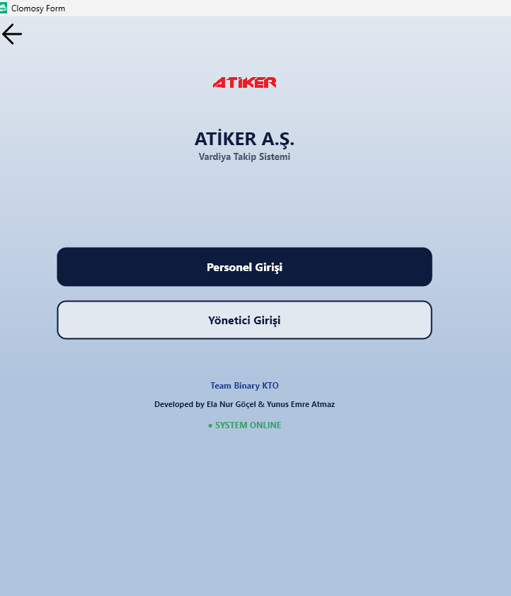
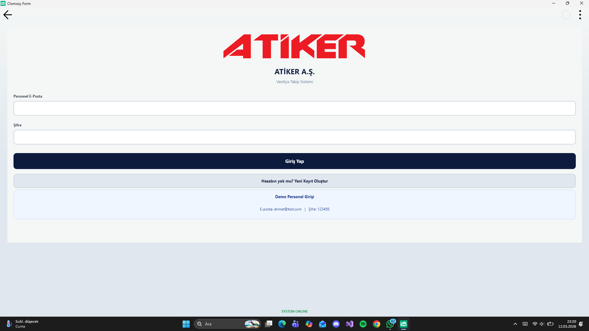
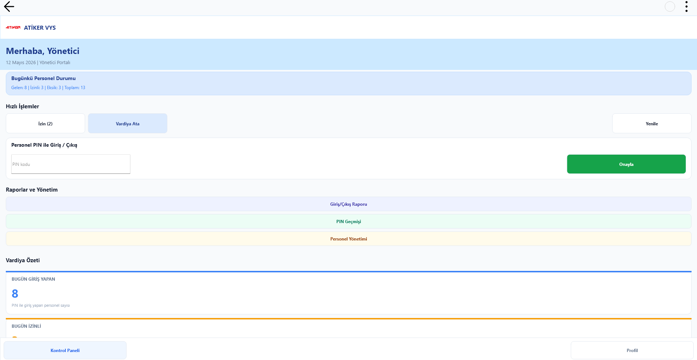
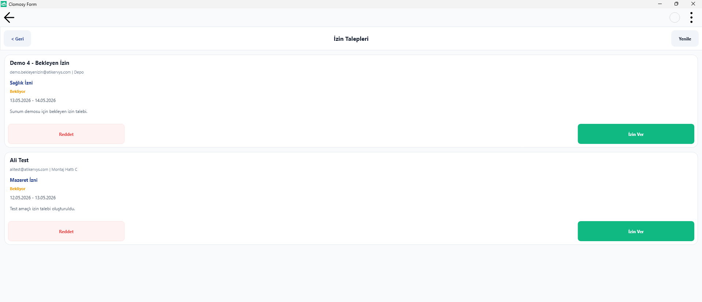
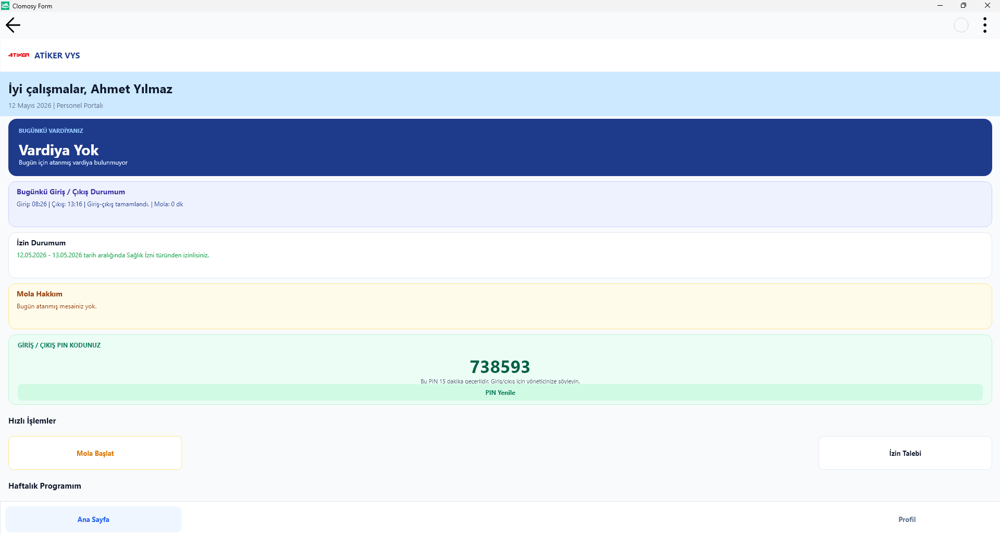
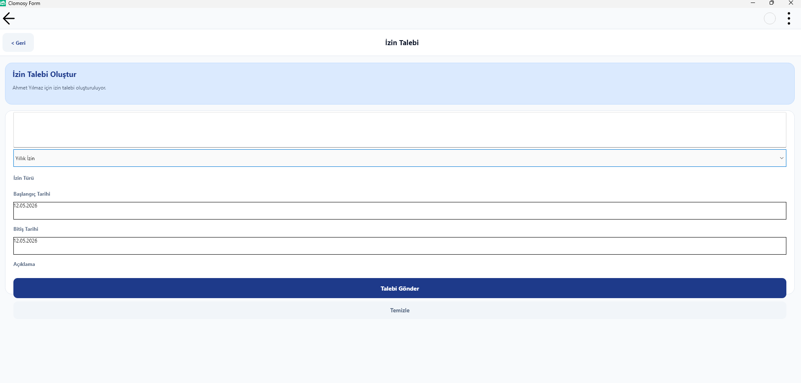

# VardiyaApp

Bu proje, çalışan vardiya takibi, giriş-çıkış raporları, izin talepleri ve yönetici / personel yönetimi işlevlerini içeren bir uygulamadır.

## İçerik

- MainCode.tro ve uygulama ekranlarını içeren .tro dosyaları
- calisan.tro, calisangiris.tro, izintalebi.tro, yoneticigiris.tro gibi çalışan ve giriş ekranları
- personelyonetim.tro, yonetici.tro, izin.tro, ardiyaatama.tro vb. yönetim ekranları

## Supabase yapılandırması

Bu uygulama Supabase REST API ile çalışmak üzere tasarlanmıştır. GitHub'a yüklemeden önce aşağıdaki değerleri kesinlikle proje dosyalarına sabit olarak yazmayın:

- SUPABASE_URL
- SUPABASE_KEY

Projede bu değerler tüm .tro dosyalarında boş bırakıldı ve GitHub'a yüklenirken gizlilik korunması için kaldırıldı.

## Nasıl kullanılır

1. Projeyi açın ve geliştirme ortamınızda çalıştırın.
2. Supabase yapılandırmasını güvenli biçimde sağlayın.
3. SupabaseAyarla fonksiyonlarına kendi Supabase URL ve anahtar bilgilerinizi ekleyin ya da proje için güvenli bir yapılandırma yöntemi kullanın.

## Ekran görüntüleri ve demo videosu

Aşağıdaki ekran görüntüleri proje kökünde yer alan `ScreenShots/` klasöründe bulunuyor. Bu dosyalar, uygulamanın hem personel hem yönetici tarafındaki çalışan sayfa tasarımlarını gösterir.

- `ScreenShots/Giris.png`
- `ScreenShots/personelgiris.png`
- `ScreenShots/yöneticiGiris.png`
- `ScreenShots/yöneticianasayfa.png`
- `ScreenShots/yöneticivardiyatama.png`
- `ScreenShots/yöneticivardiyatama2.png`
- `ScreenShots/yöneticiizintalebi.png`
- `ScreenShots/yöneticiverilenpingecmisi.png`
- `ScreenShots/yöneticigirisçıkıştakibi.png`
- `ScreenShots/calisananasayfa.png`
- `ScreenShots/calisanizintalebi.png`
- `ScreenShots/calisanmolatalebi.png`
- `ScreenShots/calisanprofil.png`

### Öne çıkan ekran görüntüleri

#### Ana giriş ekranı

#### Personel giriş ekranı

#### Yönetici kontrol paneli

#### İzin talepleri ekranı

#### Personel ana sayfası

#### Personel izin talebi ekranı

Bu proje için ayrıca ek bir demo videosu da sağladınız:

- `c:\Users\Lenovo\AppData\Local\Packages\Microsoft.ScreenSketch_8wekyb3d8bbwe\TempState\Recordings\20260515-2110-17.0778274.mp4`

> Not: Bu video dosyası repo içinde yer almıyor. Eğer isterseniz videoyu proje köküne veya `assets`/`media` klasörüne taşıyın, ben sonra README içindeki bağlantıyı güncelleyeyim.

